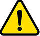

| マーク | 注意 |
| :---: | :--- |
|  | 使用中は平らな安定した非導電性の面に置き、導電性の物に接触させないでください。製品が故障する原因になリます。 |
|  | 各種コネクタの挿抜は、コネクタ仕様に合わせて適切に行ってください。無理な挿抜やケープルを引っ張ると製品が破損する原因になリます。 |
|  | 製品を熱源や高強度の光源（キセノンやレーザーなど）に晒さないでください。故障の原因になリます。 |
|  | 除電をせずに製品に直接触れないでください。また、製品が故障する原因になります。 |