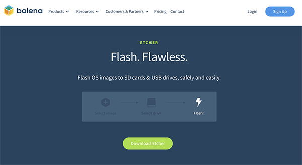
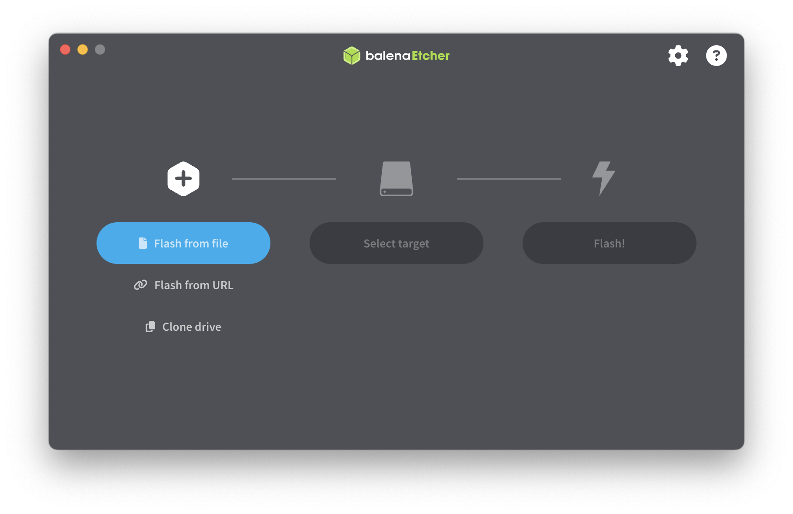
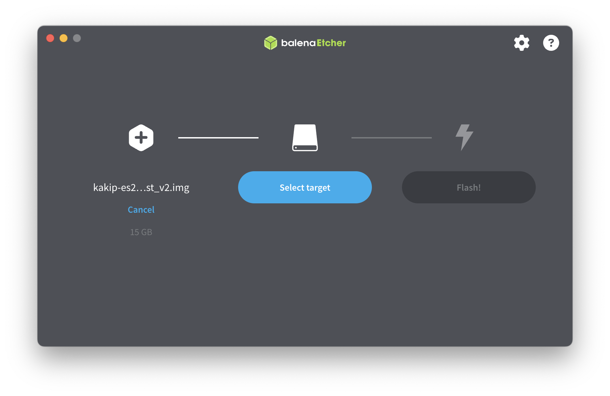
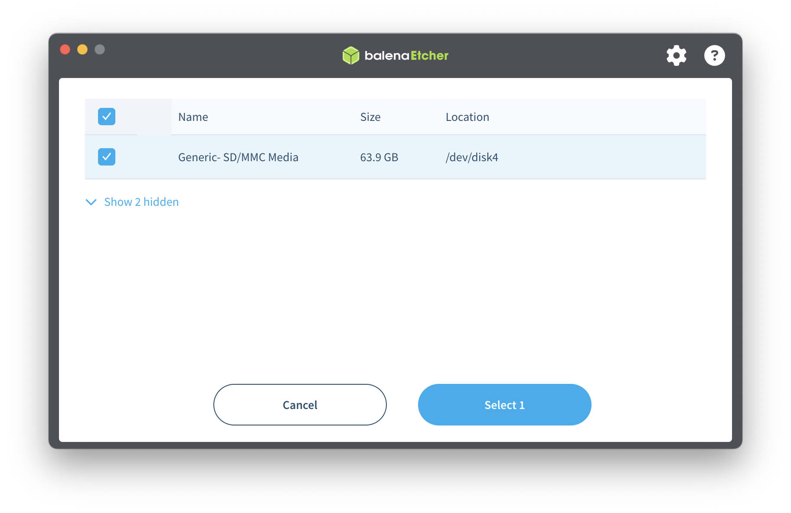
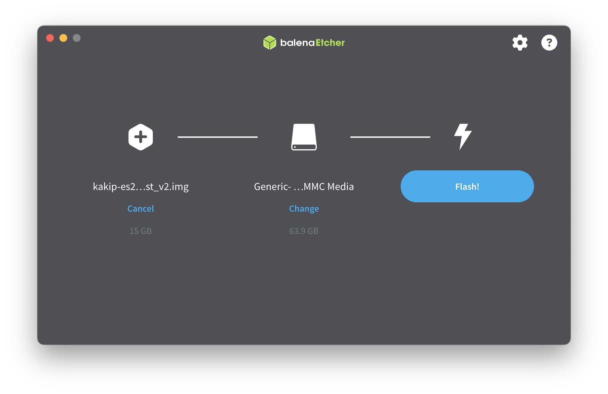
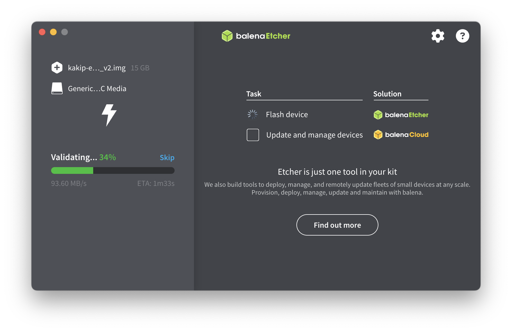
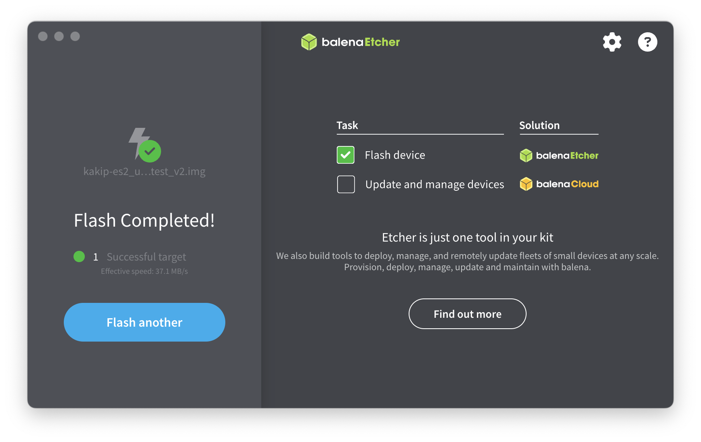
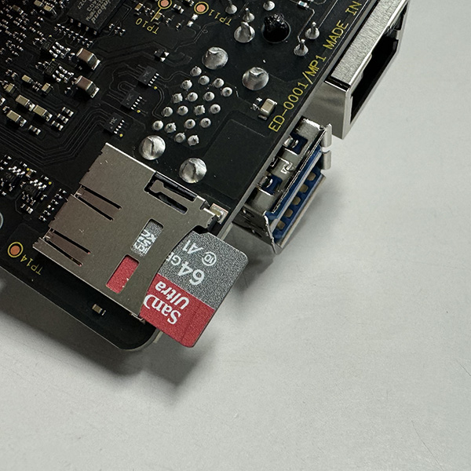

## Kakip OS Bootable Media Creation Procedure

We provide Linux-based software optimized for Kakip so that users can start development smoothly. This section shows the procedure for obtaining the basic software package (OS and device drivers) that comes with Kakip and creating bootable media.

### What you need

* A computer that can download the OS image and write to a microSD card (any OS)

### Downloading the Kakip OS image

Please obtain the kakip OS image from the link below. (Zip File size: approx. 3GB)

[kakip_os_image_v5 (2024.10.01)](https://www.kakip.ai/software/)

### Extracting to microSD card

There are several tools for extracting img files to media, but here we will show you how to use balena's "Etcher". Download Etcher from the following website and install it in each environment.

[Download Etcher here](https://etcher.balena.io/)

#### Selecting an img file

Launch the downloaded and installed Etcher.

From "Flash From File", select the img file you just downloaded.

#### Selecting the target media

Select the img file you downloaded earlier from "Select Target".

#### Extracting the image

Press the "Flash" button to begin extracting the image.

After extraction, a validation process will be performed to check.

When the message "Flash Completed!" appears, the process is complete. Unmount and remove the media.

### Inserting the media into Kakip

Insert the SD card you have written to into the microSD card slot on the back of the Kakpi.
