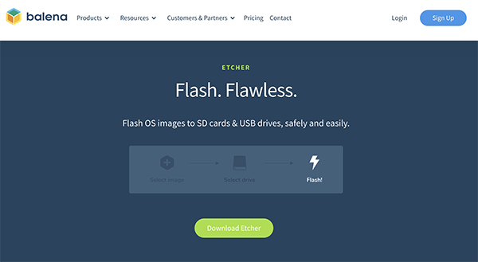
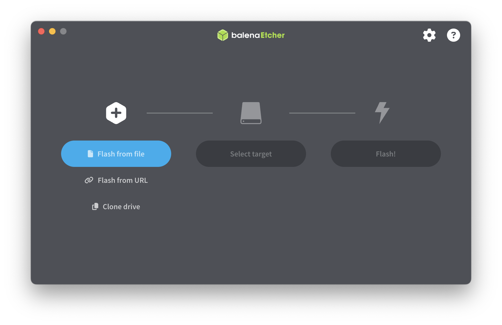
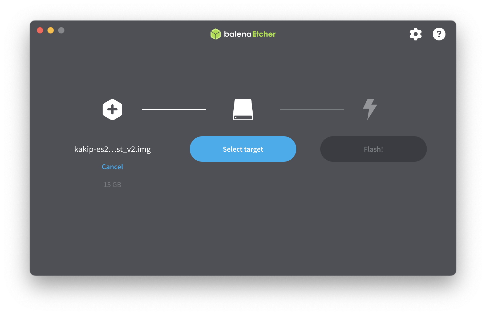
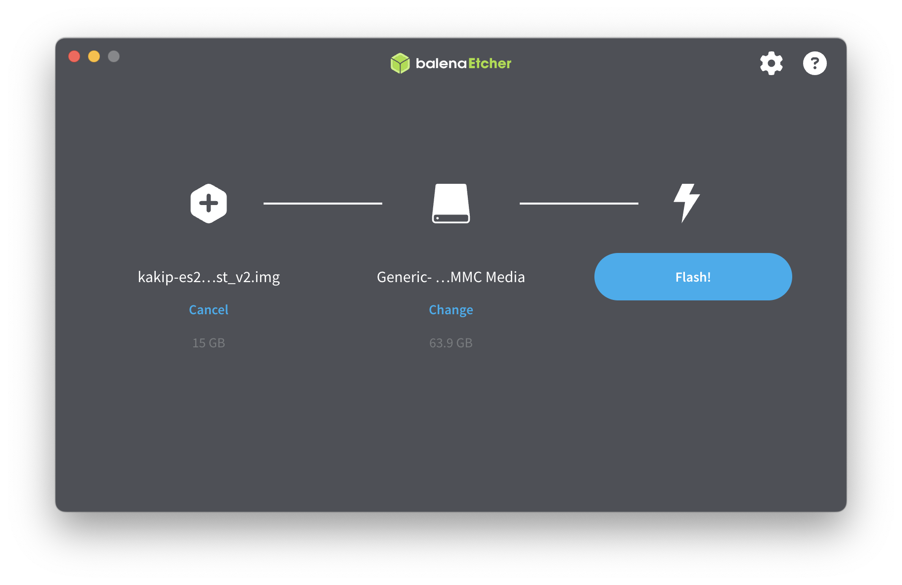
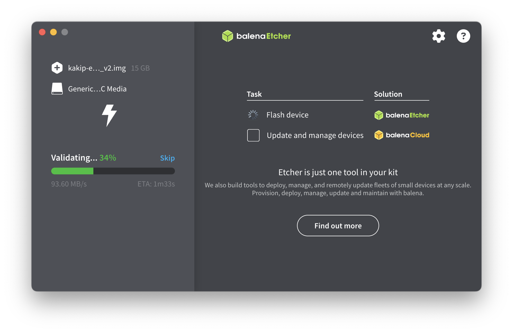
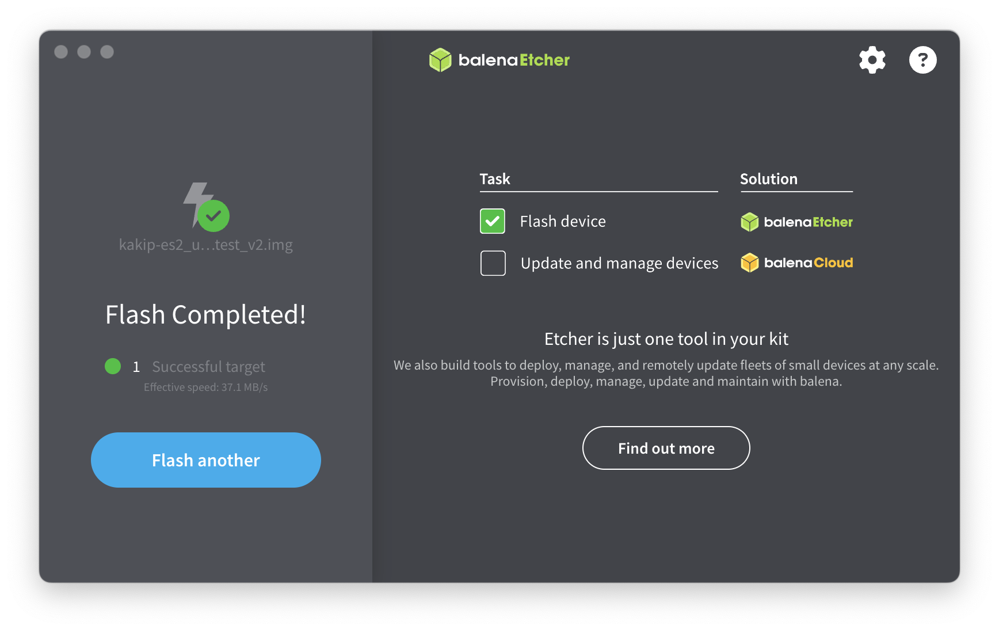

## KakipのOSブートメディア作成手順

ユーザーが円滑に開発を始められるよう、Kakip向けに最適化されたLinuxベースのソフトウェアを提供しています。本項目ではKakipに付属する基本ソフトウェアパッケージ（OSおよびデバイスドライバ類）を取得し、ブートメディアを作成する手順を示します。

### ご用意いただくもの

* OSイメージをダウンロード可能なパソコン（microSDカードへの書き込みが可能であれば、OSはWindows、MAC、Linux問いません）

### Kakip OSイメージのダウンロード

kakipのOSイメージは以下のリンクより取得ください。（Zipファイルサイズ：約3GB）

[kakip_os_image_v5 (2024.10.01)](https://www.kakip.ai/software/)

### microSDカードへの展開

imgファイルのメディアへの展開ツールは何種類かありますが、ここではbalenaの「Etcher」を使用する手順を示します。Etcherは以下ウェブサイトからダウンロードし、各環境にインストールしてください。

[Etcherのダウンロードはこちら](https://etcher.balena.io/)

#### imgファイルの選択

ダウンロード、インストールしたEtcherを起動します。

「Flash From File」より、先ほどダウンロードしたimgファイルを選択します。

#### ターゲットメディアの選択

「Select Target」より、先ほどダウンロードしたimgファイルを選択します。

#### イメージの展開

「Flash」ボタンを押すと、イメージの展開が開始します。

展開後、チェックのためValidationのプロセスが入ります。

「Flash Completed!」のメッセージが出たら完了です。アンマウントしてメディアを取り出してください。

### Kakipへのメディア装着

書き終えたSDカードをKakp裏面のmicroSDカードスロットにに挿入してください。