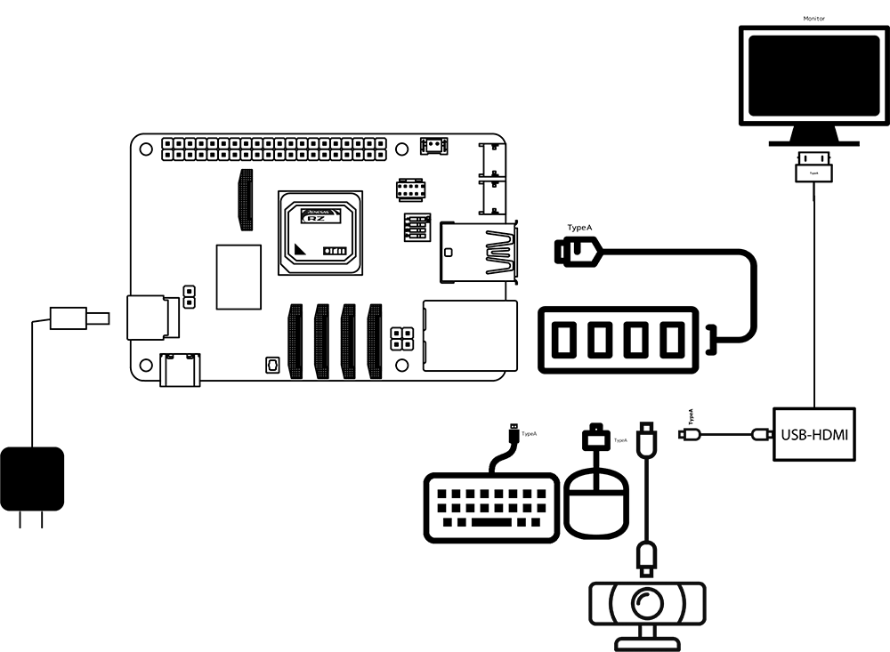
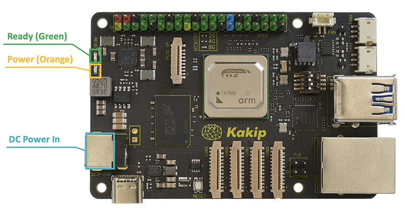
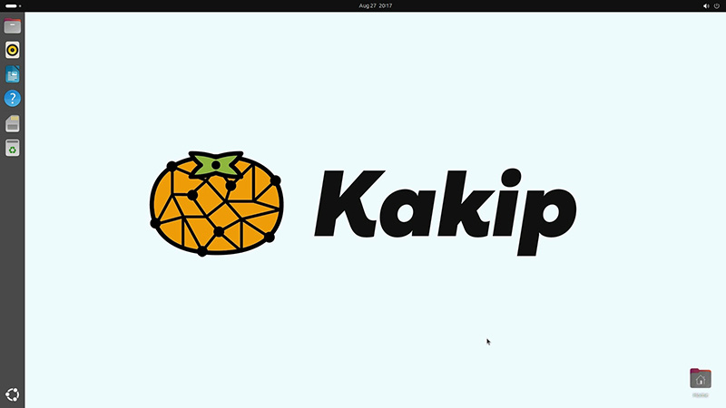

## Starting Kakip

### Connecting devices

Example of connecting various devices via USB Hub

### Turning on the power

* When power is connected from the DC jack, POWER (orange LED) lights up.
* When power is applied to the RZ/V2H, READY (green LED) lights up. "READY" turns off when a power error is detected or the reset button is pressed.

### Starting the OS

When the OS image is correctly deployed to the microSD card and the power is applied normally, the OS startup process is displayed on the monitor and the Ubuntu GUI screen starts.  (Initial Password is "ubuntu")

※It takes about 20 seconds for the boot process screen to appear and less than 2 minutes for the Ubuntu boot screen.

