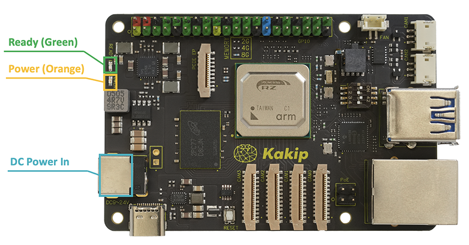
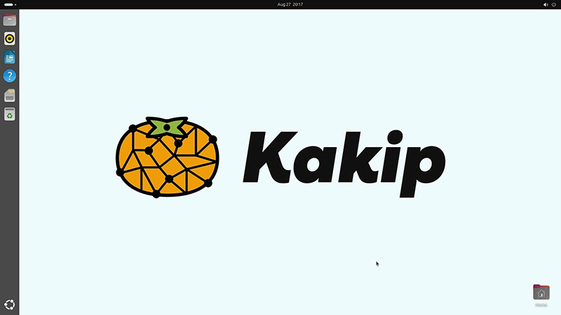

## Kakipの起動

### 機器の接続

USB Hubを介しての各種機器の接続例

### 電源の投入

* DCジャックから電源が接続されるとPOWER（オレンジのLED）が点灯します。
* RZ/V2Hへ電源が投入されるとREADY（緑のLED）が点灯します。「READY」は電源エラー検出時またはリセットボタン押下時は消灯します。

### OSの起動

microSDカードへOSイメージが正しく展開され、電源が正常に投入されるとモニターにOSの起動プロセスが表示され、UbuntuのGUI画面が起動します。（初期設定パスワード： ubuntu）

※起動プロセスの画面が出るのに20秒程度、Ubuntuの起動画面まで2分弱の時間がかかります。

