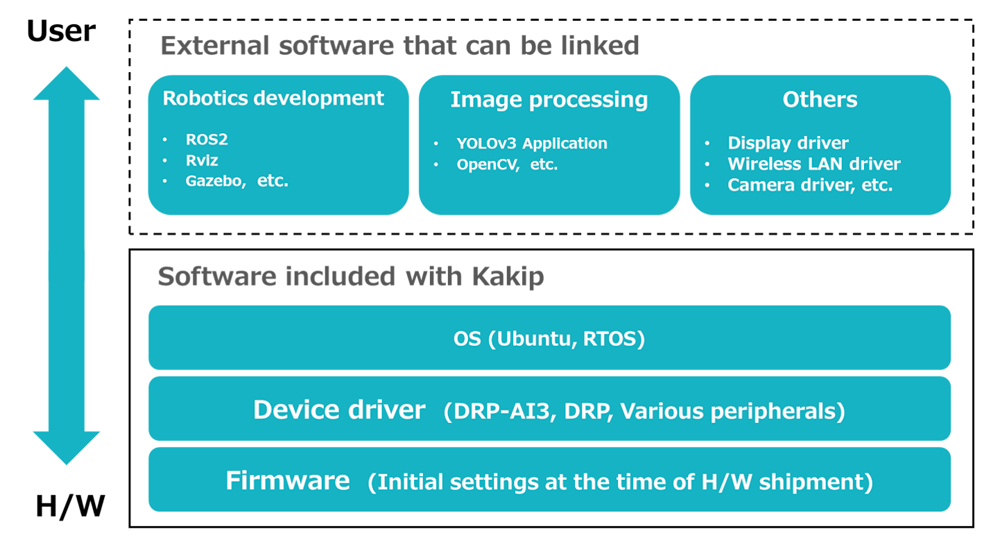

## About Kakip software
### Overview
We provide Linux-based software optimized for Kakip so that users can smoothly start development and integration. This software is designed to make the most of the AI ​​inference processing by DRP-AI3, and is intended to be linked with various software that is particularly useful for robotics development.

***
### Kakip software stack
The software configuration of Kakip is as shown in the figure below. The wavy lines are items that users will need to build as needed.
#### Software configuration during Kakip actual operation

***
### GitHub
The latest software (excluding OS images) and accompanying documentation such as tutorials on installation will be provided in the following GitHub repository.  
[GitHub: Kakip-ai](https://github.com/Kakip-ai)

***
### About the OS
#### Linux OS
The following OS applicable to Cortex-A55 is provided.

Ubuntu 24.04 (The kernel is adjusted based on the Yocto Linux kernel included in the AI ​​SDK provided by Renesas)

#### RTOS
RTOS applicable to Cortex-R8 and Cortex-M33 will be provided in the future. (Not implemented as of October 7, 2024)

***
### Device Driver
The BSP included with Kakip includes the following device drivers.

#### DRP-AI Driver
The data (binary) of the neural network model generated via the DRP-AI Translator (Renesas) is launched based on instructions from the user application.

#### DRP Driver
The data (configuration data) representing the circuit information generated by OpenCV Accelerator (Renesas) etc. is loaded, and the circuit information is written to the DRP.

#### Device drivers for various peripherals
Device drivers for various peripherals are installed. For details, see GitHub.

***
### Firmware
Based on Renesas AI SDK v5.00, firmware such as U-Boot has been modified according to the Kakip hardware configuration. For details, see GitHub.

***
### External software that can be linked
This section introduces representative external software that has been confirmed to work with the Linux-based software we provide. Instructions for installing these external software are available as tutorials on GitHub.

#### Robotics development related
Open source frameworks and tools specialized for robotics system development
* ROS2
* Rviz
* Gazebo

#### AI image processing related
Applications and libraries used in image processing using DRP-AI3 and DRP
* YOLOv3 app
* OpenCV
***
### Other
#### MPU manufacturer-provided SDK
The AI ​​Software Development Kit (AI SDK) provided by Renesas is available for the MPU RZ/V2H used in Kakip. This AI SDK is an AI application development environment designed for the Renesas's RZ/V series evaluation board kits, and includes a boot loader, Linux kernel, cross compiler, and a library set for DRP-AI3 and graphics.  
The software development for the first mass production lot of kakip also referred to AI SDK v5.00, and the Ubuntu Linux kernel is adjusted based on the Yocto Linux kernel included in the AI ​​SDK BSP. The device driver is also implemented with the same version as the AI ​​SDK BSP.  
We also use DRP-AI3, which is included in the AI ​​SDK, and tools for utilizing DRP (DRP-AI Translator, OpenCV Accelerator, etc.).