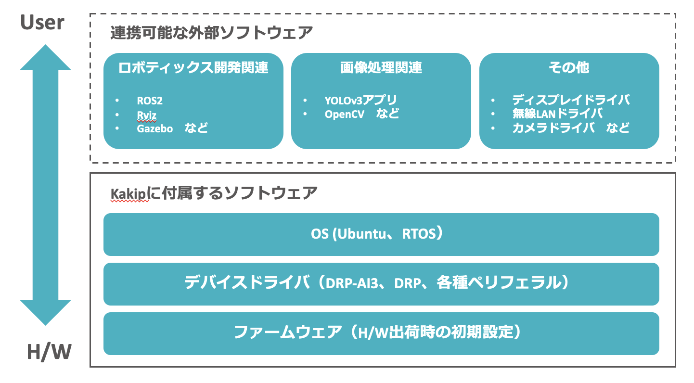

## Kakipのソフトウェアに関して
### 概要
ユーザーが円滑に開発や組込を開始できるよう、Kakip向けに最適化されたLinuxベースのソフトウェアを提供します。本ソフトウェアはDRP-AI3によるAI推論処理を最大限に活用できるように設計されており、特にロボティクス開発に有用な各種ソフトウェアとの連携を前提としている。

***
### Kakipのソフトウェアスタック
Kakipのソフトウェア構成は以下の図のようになります。波線部分は必要に応じてユーザーにて構築いただく項目になります。
#### Kakip実運用時のソフトウェア構成

***
### GitHub
最新のソフトウェア（OSイメージを除く）、それに付随する導入に関するチュートリアルなどのドキュメント等は以下のGitHubリポジトリにて提供致します。 
[GitHub: Kakip-ai](https://github.com/Kakip-ai)

***
### OSについて
#### Linux OS
Cortex-A55に適用可能な以下のOSを提供する。
Ubuntu 24.04（カーネルはRenesas社提供のAI SDKに含まれるYocto Linuxのカーネルをベースに調整している）

#### RTOS
Cortex-R8及びCortex-M33に適用可能なRTOSは今後提供予定です。（2024年10月7日時点では未実装）

***
### デバイスドライバ
Kakipに付属するBSPには、以下のデバイスドライバが含まれております。

#### DRP-AI Driver
DRP-AI Translator（Renesas）を介して生成されたニューラルネットワークモデルのデータ（バイナリ）をユーザーアプリからの指示に基づいて起動する。

#### DRP Driver
OpenCV Accelerator（Renesas）などで生成された回路情報を表すデータ（コンフィグレーションデータ）をロードし、DRPへ回路情報を書き込む。

#### 各種ペリフェラル用デバイスドライバ
各種ペリフェラルに対応したデバイスドライバをインストールしている。詳細はGitHubを参照ください。

***
### ファームウェア
Renesas AI SDK v5.00を基盤とし、Kakipのハードウェア構成に応じて、U-Boot等のファームウェアに修正を施している。詳細はGitHubを参照ください。

***
### 連携可能な外部ソフトウェア
本項では、提供するLinuxベースのソフトウェア上で動作確認済みの代表的な外部ソフトウェアを紹介します。これらの外部ソフトウェアの導入手順についてはGitHubにてチュートリアルとして公開しております。

#### ロボティクス開発関連
ロボティックスシステム開発に特化した、オープンソースのフレームワーク及びツール
* ROS2
* Rviz
* Gazebo

#### AI画像処理関連
DRP-AI3及びDRPを用いた画像処理において使用されるアプリケーション及びライブラリ
* YOLOv3 アプリ
* OpenCV

***
### その他
#### MPUメーカー提供SDK
Kakipで使用しているMPU RZ/V2Hには、Renesasから提供されるAI Software Develpment Kit（AI SDK）が利用可能です。このAI SDKは同社のRZ/Vシリーズの評価ボードキット向けに設計されたAIアプリケーション開発環境であり、ブートローダー、Linuxカーネル、クロスコンパイラ及びDRP-AI3やグラフィックス用のライブラリセットが含まれています。 
kakipの量産初ロット時点におけるソフトウェア開発においても、AI SDK v5.00を参考にしており、UbuntuのLinuxカーネルはAI SDKのBSPに含まれるYocto Linuxのカーネルをベースに調整しています。デバイスドライバもAI SDKのBSPと同等のものが実装されています。 
また、AI SDKに含まれるDRP-AI3及びDRPを活用するためのツール（DRP-AI Translator、OpenCV Acceleratorなど）も合わせて利用しています。
