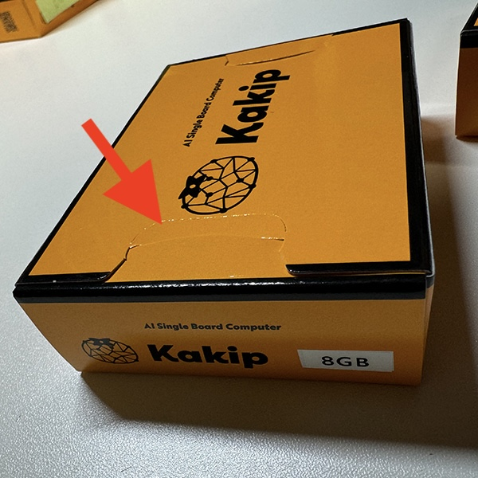

## Introduction
### Open the packaging box

Kakip's packaging box uses the locking system to prevent theft. 
The box is opened by tearing the part indicated by the arrow in the photo.

*If this part is opened when you receive the product, please contact the seller.

### Items to prepare separately

Kakip does not currently come with any accessories.
The following items are required to use the product, so please prepare them separately.
(This is an example, as it varies depending on the purpose)

**microSD card**

The Kakip OS image is approximately 15GB, so please prepare a card with a capacity of 16GB or more.
This is for OS booting, but please consider the capacity depending on the applications you need.

Maximum supported capacity: [TBD]

***
**AC adapter**

Kakip is powered by a DC jack.
Please prepare the following specifications.

* DC12V/25W or more output
* DC jack (outer diameter: φ5.5mm, pin: φ2.1mm, Center plus)

***
**USB TypeA Hub**

Kakip has two USB TypeA connectors (USB3.2 Gen1), but there may not be enough ports for operating devices to use the Ubuntu GUI environment, monitor output, USB camera image capture, etc.
In that case, please expand it with a USB TypeA hub.

***
**Mouse and keyboard**

We recommend a USB TypeA wired connection.

***
**USB TypeA - HDMI converter**

Kakip does not have an interface dedicated to monitor output such as Display Port or HDMI. 
For HDMI output, you will need to prepare a USB TypeA - HDMI converter equipped with a DisplayLink chip.

As of October 1, 2024
The following models have been confirmed to work with Kakip.
* Buffalo [GX-HDMI/U2](https://www.buffalo.jp/product/detail/gx-hdmi_u2.html)
* Wavlink [WL-UG17D1](https://www.wavlink.com/en_us/product/WL-UG17D1.html)

***
**Monitor**

Please prepare a monitor with HDMI input.

