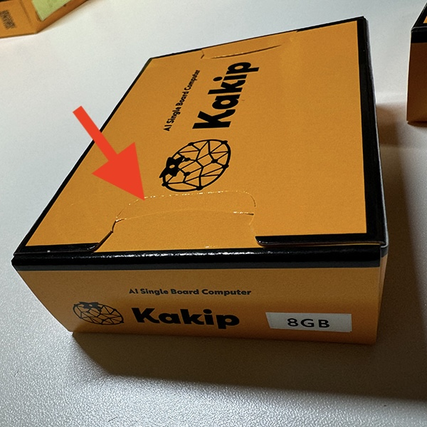

## はじめに
### 個装箱の開封

Kakipの個装箱は盗難防止のためにロック式のものを採用しております。写真の矢印部分を破って開封する仕組みになっております。

※届いた際に万が一、この部分が開封された状態になっておりましたら販売元にご連絡ください。

### 別途ご用意いただくもの

Kakipには現状付属品がございません。ご使用いただくにあたって、以下のものが必要となりますので、別途ご用意お願い致します。（用途により異なりますので一例となります）

**microSDカード**

Kakip OSイメージはおおよそ15GB程度となりますので16GB以上の容量のものをご用意ください。OSブート用となりますが、必要なアプリケーション等に応じて容量を考慮ください。

対応最大容量：【TBD】

***
**ACアダプタ**

Kakipの電源はDCジャックからの供給となります。以下の仕様のものをご用意ください。

* DC12V/25W以上の出力
* DCジャック（外形：φ5.5mm、ピン：φ2.1mm、センタープラス）形状のもの

***
**USB TypeA Hub**

KakipはUSB TypeAコネクタ（USB3.2 Gen1）を2ポート搭載していますが、UbuntuのGUI環境を使用するための操作デバイスや、モニタ出力、USBカメラの映像取り込みなど、ポートが足りない場合がございます。その場合、市販のUSB TypeAのHubで拡張してご使用ください。

***
**マウス・キーボード**

USB TypeAの有線接続のものを推奨いたします。

***
**USB TypeA - HDMI変換器**

KakipはDisplay PortやHDMIといったモニタ出力専用のインターフェースを搭載しておりません。HDMI出力のためにはDisplayLinkチップ搭載のUSB TypeA - HDMI変換器をご用意いただく必要がございます。

2024年10月1日現在
Kakipで動作確認が取れている機種は以下となります。
* Buffalo [GX-HDMI/U2](https://www.buffalo.jp/product/detail/gx-hdmi_u2.html)
* Wavlink [WL-UG17D1](https://www.wavlink.com/en_us/product/WL-UG17D1.html)

***
**モニタ**

HDMI入力のモニタを適宜ご用意ください。