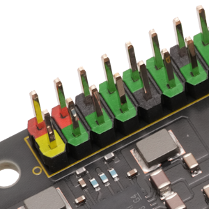

## Connector (CN6) #

### Connector Type
40ピン・カラーピンヘッダ 2x20 2.54mmピッチ
 

### Pin Assignment

<table>

<tr>
    <th class="table_name_left">Name</th>
    <th class="table_pin">Pin</th>
    <th class="table_pin">Pin</th><th class="table_name_right">Name</th>
</tr>

<tr>
    <td class="table_name_left" style="background-color: lightyellow;">3.3V_PWR</td>
    <td class="table_pin">1</td>
    <td class="table_pin">2</td>
    <td class="table_name_right" style="background-color: pink">5V_PWR</td>
</tr>

<tr>
    <td class="table_name_left" style="background-color: lightgreen;">GPIO2 / I2C_SDA</td>
    <td class="table_pin">3</td>
    <td class="table_pin">4</td>
    <td class="table_name_right" style="background-color: pink">5V_PWR</td>
</tr>

<tr>
    <td class="table_name_left" style="background-color: lightgreen;">GPIO3 / I2C_SCL</td>
    <td class="table_pin">5</td>
    <td class="table_pin">6</td>
    <td class="table_name_right" style="background-color: lightgrey">GND</td>
</tr>

<tr>
    <td class="table_name_left" style="background-color: lightgreen;">GPIO4 / GPCLK0</td>
    <td class="table_pin">7</td>
    <td class="table_pin">8</td>
    <td class="table_name_right" style="background-color: lightgreen">GPIO14 / UART_TXD</td>
</tr>

<tr>
    <td class="table_name_left" style="background-color: lightgray;">GND</td>
    <td class="table_pin">9</td>
    <td class="table_pin">10</td>
    <td class="table_name_right" style="background-color: lightgreen">GPIO15 / UART_RXD</td>
</tr>

<tr>
    <td class="table_name_left" style="background-color: lightgreen;">GPIO17 / UART_RTS</td>
    <td class="table_pin">11</td>
    <td class="table_pin">12</td>
    <td class="table_name_right" style="background-color: lightgreen">GPIO18 / I2S_SCLK</td>
</tr>

<tr>
    <td class="table_name_left" style="background-color: lightgreen;">GPIO27 / SD_DAT3</td>
    <td class="table_pin">13</td>
    <td class="table_pin">14</td>
    <td class="table_name_right" style="background-color: lightgrey">GND</td>
</tr>

<tr>
    <td class="table_name_left" style="background-color: lightgreen;">GPIO22 / SD_CLK</td>
    <td class="table_pin">15</td>
    <td class="table_pin">16</td>
    <td class="table_name_right" style="background-color: lightgreen">GPIO23 / SD_CMD</td>
</tr>

<tr>
    <td class="table_name_left" style="background-color: lightyellow;">3.3V_PWR</td>
    <td class="table_pin">17</td>
    <td class="table_pin">18</td>
    <td class="table_name_right" style="background-color: lightgreen">GPIO24 / SD_DAT0</td>
</tr>

<tr>
    <td class="table_name_left" style="background-color: lightgreen;">GPIO10 / SPI_MOSI</td>
    <td class="table_pin">19</td>
    <td class="table_pin">20</td>
    <td class="table_name_right" style="background-color: lightgrey">GND</td>
</tr>

<tr>
    <td class="table_name_left" style="background-color: lightgreen;">GPIO9 / SPI_MISO</td>
    <td class="table_pin">21</td>
    <td class="table_pin">22</td>
    <td class="table_name_right" style="background-color: lightgreen">GPIO25 / SD_DAT1</td>
</tr>

<tr>
    <td class="table_name_left" style="background-color: lightgreen;">GPIO11 / SPI_SCK</td>
    <td class="table_pin">23</td>
    <td class="table_pin">24</td>
    <td class="table_name_right" style="background-color: lightgreen">GPIO8 / SPI_SS0_N</td>
</tr>

<tr>
    <td class="table_name_left" style="background-color: lightgray;">GND</td>
    <td class="table_pin">25</td>
    <td class="table_pin">26</td>
    <td class="table_name_right" style="background-color: lightgreen">GPIO7 / SPI_SS1_N</td>
</tr>

<tr>
    <td class="table_name_left" style="background-color: lightblue;">GPIO0 / ID_SDA</td>
    <td class="table_pin">27</td>
    <td class="table_pin">28</td>
    <td class="table_name_right" style="background-color: lightblue">GPIO1 / ID_SCL</td>
</tr>

<tr>
    <td class="table_name_left" style="background-color: lightgreen;">GPIO5</td>
    <td class="table_pin">29</td>
    <td class="table_pin">30</td>
    <td class="table_name_right" style="background-color: lightgrey">GND</td>
</tr>

<tr>
    <td class="table_name_left" style="background-color: lightgreen;">GPIO6</td>
    <td class="table_pin">31</td>
    <td class="table_pin">32</td>
    <td class="table_name_right" style="background-color: lightgreen">GPIO12 / PWM0</td>
</tr>

<tr>
    <td class="table_name_left" style="background-color: lightgreen;">GPIO13 / PWM1</td>
    <td class="table_pin">33</td>
    <td class="table_pin">34</td>
    <td class="table_name_right" style="background-color: lightgrey">GND</td>
</tr>

<tr>
    <td class="table_name_left" style="background-color: lightgreen;">GPIO19 / I2S_LRCK</td>
    <td class="table_pin">35</td>
    <td class="table_pin">36</td>
    <td class="table_name_right" style="background-color: lightgreen">GPIO16 / UART_CTS</td>
</tr>

<tr>
    <td class="table_name_left" style="background-color: lightgreen;">GPIO26 / SD_DAT2</td>
    <td class="table_pin">37</td>
    <td class="table_pin">38</td>
    <td class="table_name_right" style="background-color: lightgreen">GPIO20 / I2S_SDI</td>
</tr>

<tr>
    <td class="table_name_left" style="background-color: lightgray;">GND</td>
    <td class="table_pin">39</td>
    <td class="table_pin">40</td>
    <td class="table_name_right" style="background-color: lightgreen">GPIO21 / I2S_SDO</td>
</tr>

</table>

### Excerpt Schematics

