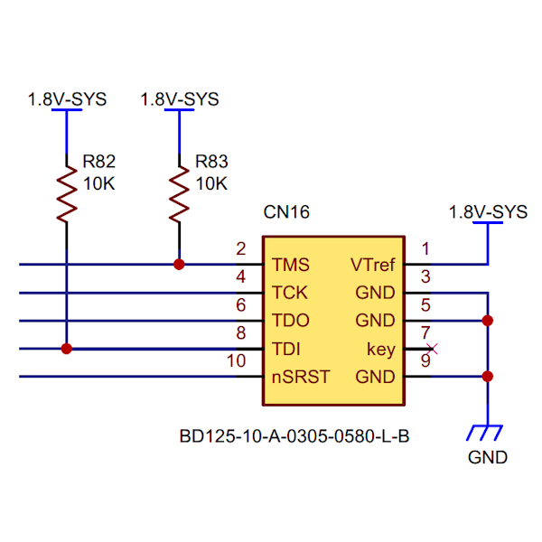

## Connector (CN16) #

### Connector type
Pin Header, 2x5position, pitch 1.27mm
* Manufacturer: GCT
* Parts #: BD125-10-A-0305-0580-L-B

### Pin Assignment
|Name|Pin|Pin|Name|
|---:|:---:|:---:|:---|
|VTref|1|2|TMS|
|GND|3|4|TCK|
|GND|5|6|TDO|
|key|7|8|TDI|
|GND|9|10|nSRST|

### Excerpt Schematics

#### Note
Primarily for debugging purposes, it provides clock-synchronous serial communication via JTAG and SWD.