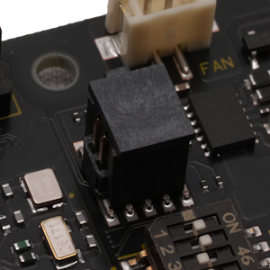

## Connector (CN16) #

### Connector type
ピン・ヘッダー、2x5ピン、1.27mmピッチ
* Manufacturer: CTS Electrocomponents
* Parts #: 218-4LPSTR

### Pin Assignment
|Name|Pin|Pin|Name|
|---:|:---:|:---:|:---|
|VTref|1|2|TMS|
|GND|3|4|TCK|
|GND|5|6|TDO|
|key|7|8|TDI|
|GND|9|10|nSRST|

#### 使用上の注意点
主にデバッグを目的として、JTAG、SWDによるクロック同期式シリアル通信を提供します。