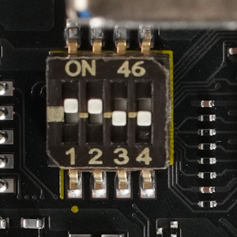

### Parts type
DIP switch, 4position
* Manufacturer: CTS Electrocomponents
* Parts #: 218-4LPSTR

#### SW1 operation setting
|DIP#|Name|Position| Description|
|:---|:---|:---:|:---|
|1|BOOTSEL|ON|Boot from Cortex-A55|
|||OFF|Boot from Cortex-A33|
|2/3|MD BOOT|ON/ON|Prohibited|
|||OFF/ON|Boot from SCIF (CM33, CA55)|
|||ON/OFF|Boot from SD card (CA55 only)*|
|||OFF/OFF|Boot from QSPI-Flash (CM33, CA55)*|
|4|DEBUG EN|ON|JTAG Debugging Mode|
|||OFF|Normal mode|

(*) If there is no boot image in the specified storage, it will be migrated to SCIF.