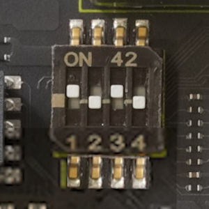

### Parts type
DIPスイッチ、4ポジション
* Manufacturer: CTS Electrocomponents
* Parts #: 218-4LPSTR

#### SW1の動作設定
|DIP#|Name|Position| Description|
|:---|:---|:---:|:---|
|1|BOOTSEL|ON|Cortex-A55からブート|
|||OFF|Cortex-A33からブート|
|2/3|MD BOOT|ON/ON|指定禁止|
|||OFF/ON|SCIFからブート(CM33, CA55)|
|||ON/OFF|SDカードからブート(CA55のみ)*|
|||OFF/OFF|QSPI-Flashからブート(CM33, CA55)*|
|4|DEBUG EN|ON|JTAGデバグモード|
|||OFF|ノーマルモード|

(*) 指定のストレージにブートイメージが無い場合はSCIFに移行