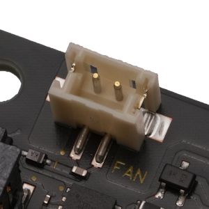

## Connector (CN7) #

### Connector type
Pin Header, 2position, pitch 1.5mm
* Manufacturer: JST
* Parts #: B2B-ZR-SM4-TF(LF)(SN)

### Pin Assignment

|Pin|Name|
|:---:|:---|
|1|FAN+|
|2|FAN-|

### Note
Provides 5V/PWM to the cooling fan.