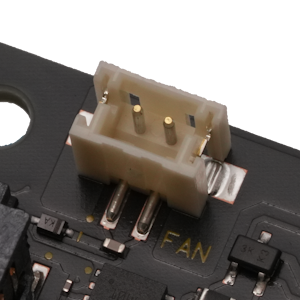
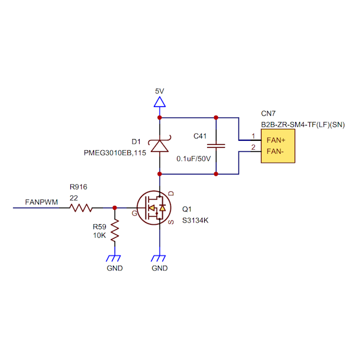

## Connector (CN7) #

### Connector type
ピン・ヘッダー、2ピン、1.5mmピッチ
* Manufacturer: JST
* Parts #: B2B-ZR-SM4-TF(LF)(SN)

### Pin Assignment

|Pin|Name|
|:---:|:---|
|1|FAN+|
|2|FAN-|

### Excerpt Schematics

### 使用上の注意点
5V/PWMを冷却ファンに供給します。