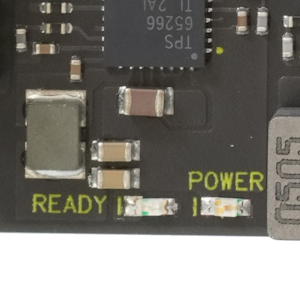
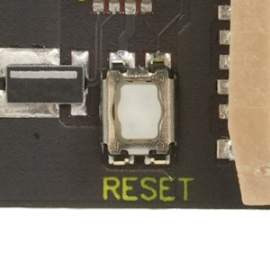

#### Specifications
* POWER: Orange light, READY: Green light.
* Reset switch: Tactile switch

#### Note
POWER lights up when power is connected to Kakip, and READY lights up when power is applied to V2H.
READY turns off if a power error is detected or the reset switch is pressed.
Resetting the reset switch or JTAG connector always results in a cold boot.