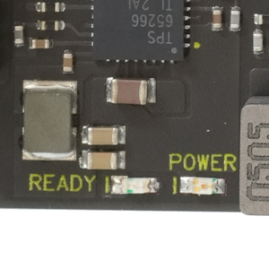
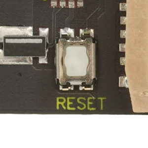

#### Specifications
* POWER: オレンジランプ、READY: 緑ランプ。
* リセットスイッチ:タクタイルスイッチ

#### 使用上の注意点
Kakipに電源が接続されるとPOWERが点灯し、V2Hへ電源が投入されるとREADYが点灯します。
READYは電源エラー検出時またはリセットスイッチ押下時は消灯します。
リセットスイッチ及びJTAGコネクタのリセットは、常にコールドブートになります。
