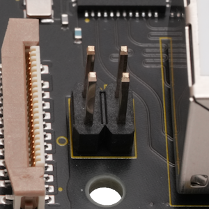

## Connector (CN3) #

### Connector type
Pin Header, 2x2position, pitch 2.54mm
* Manufacturer: Samtec
* Parts #: TSW-102-07-G-D

### Pin Assignment

|Name|Pin|Pin|Name|
|---:|:---:|:---:|:---|
|SP2|1|3|SP1|
|CT2|2|4|CT1|
