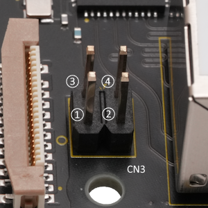
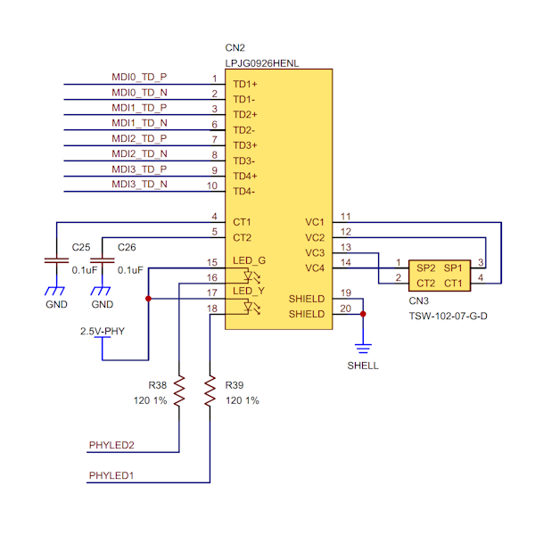

## Connector (CN3) #

### Connector type
ピン・ヘッダー、2x2ピン、2.54mmピッチ
* Manufacturer: Samtec
* Parts #: TSW-102-07-G-D

#### Pinout

|Name|Pin|Pin|Name|
|---:|:---:|:---:|:---|
|SP2|1|3|SP1|
|CT2|2|4|CT1|

### Excerpt Schematics

