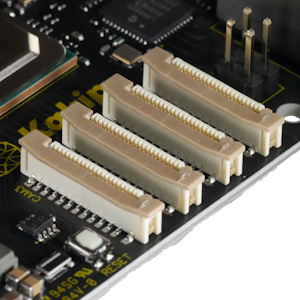

## Connector (CN10, CN12, CN14, CN15) #
* CN10(MIPI CAM0)
* CN12(MIPI CAM1)
* CN14(MIPI CAM2)
* CN15(MIPI CAM3)

### Connector type
FFC/FPCコネクタ、22ピン、0.5mmピッチ
* Manufacturer: Molex
* Parts #: 52559-2253

### Pin Assignment

|Pin|Name|
|:---:|:---|
|1|3.3V|
|2|SDA|
|3|SCL|
|4|GND|
|5|GPIO1|
|6|GPIO0|
|7|GND|
|8|DATA3_P|
|9|DATA3_N|
|10|GND|
|11|DATA2_P|
|12|DATA2_N|
|13|GND|
|14|CLOCK_P|
|15|CLOCK_N|
|16|GND|
|17|DATA1_P|
|18|DATA1_N|
|19|GND|
|20|DATA0_P|
|21|DATA0_N|
|22|GND|

