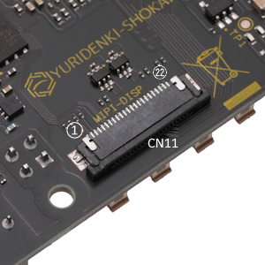
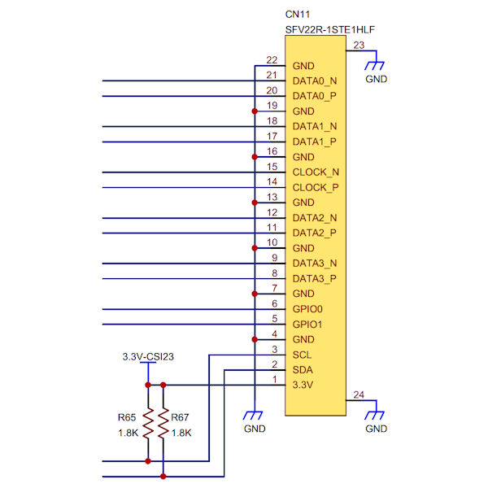

## Connector (CN11) #

### Connector type
FFC/FPC Connector, 22position, pitch 0.5mm
* Manufacturer: Amphenol
* Parts #: SFV22R-1STE1HLF

### Pin Assignment

|Pin|Name|
|:---:|:---|
|1|3.3V|
|2|SDA|
|3|SCL|
|4|GND|
|5|GPIO1|
|6|GPIO0|
|7|GND|
|8|DATA3_P|
|9|DATA3_N|
|10|GND|
|11|DATA2_P|
|12|DATA2_N|
|13|GND|
|14|CLOCK_P|
|15|CLOCK_N|
|16|GND|
|17|DATA1_P|
|18|DATA1_N|
|19|GND|
|20|DATA0_P|
|21|DATA0_N|
|22|GND|

### Excerpt Schematics

