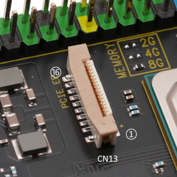
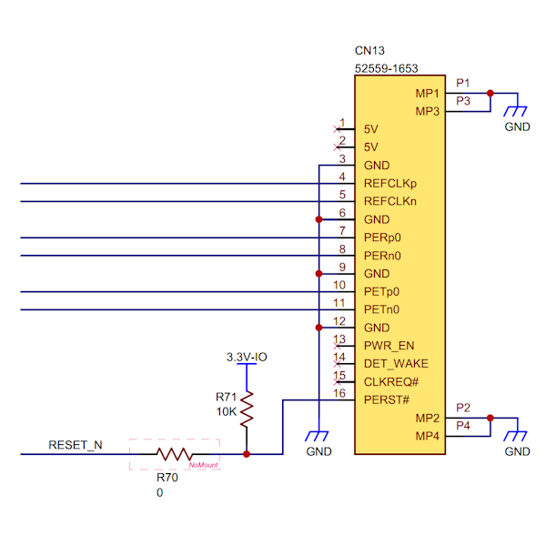

## Connector (CN13) #

### Connector type
FFC/FPCコネクタ、16ピン、0.5mmピッチ
* Manufacturer: Molex
* Parts #: 52559-1653

### Pin Assignment

|Pin|Name|
|:---:|:---|
|1|5V|
|2|5V|
|3|GND|
|4|REFCLKp|
|5|REFCLKn|
|6|GND|
|7|PERp0|
|8|PERn0|
|9|GND|
|10|PETp0|
|11|PETn0|
|12|GND|
|13|SMDAT|
|14|SMCLK|
|15|CLKREQ#|
|16|PERST#|

#### Specifications
PCI-Express Gen3、エンドポイントに対応しています。

### Excerpt Schematics

