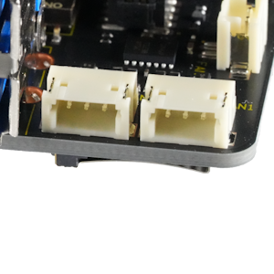

## Connector (CN8, CN9) #

### Connector type
ピン・ヘッダー、3ピン、1.5mmピッチ
* Manufacturer: JST
* Parts #: S3B-ZR-SM4A-TF(LF)(SN)

### Pin Assignment
|Pin|Name|
|:---:|:---|
|1|CANH|
|2|GND|
|3|CANL|

### Excerpt Schematics

