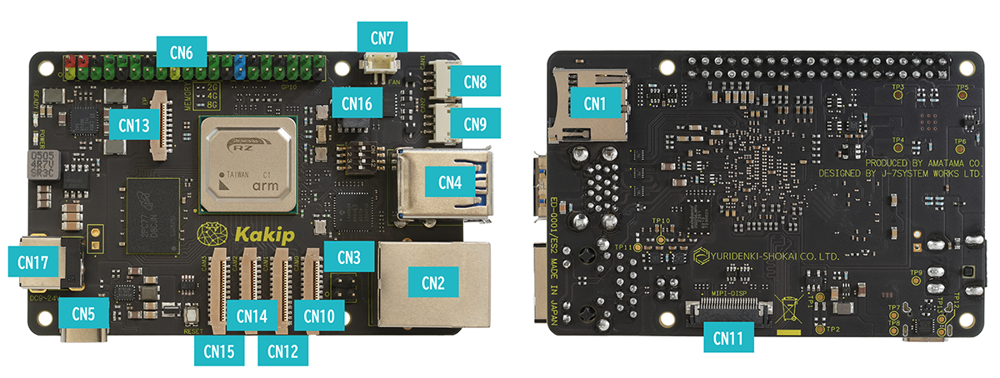

## Connectors

|CN|Name|CN|Name|
|:---|:---|:---|:---|
|1|microSD Card Slot|10|MIPI CAM0|
|2|RJ45 (Ethernet)|11|MIPI DSI|
|3|PoE Input|12|MIPI CAM1|
|4|USB Type-A x2|13|PCIe EP|
|5|USB Type-C|14|MIPI CAM2|
|6|GPIO|15|MIPI CAM3|
|7|FAN Control|16|JTAG|
|8|CAN-FD #1|17|DC IN|
|9|CAN-FD #2|||