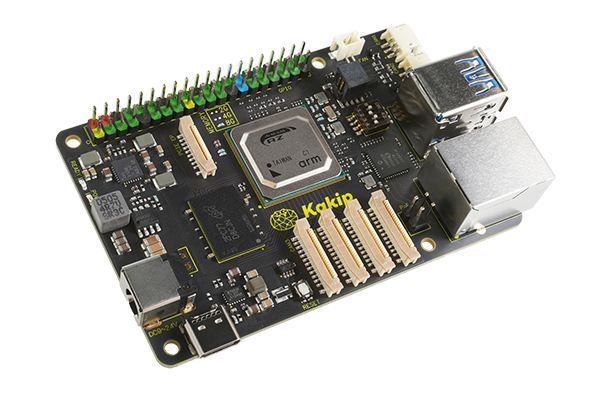
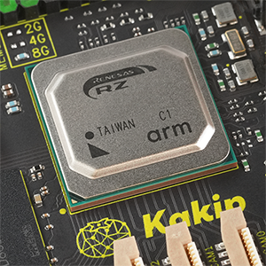
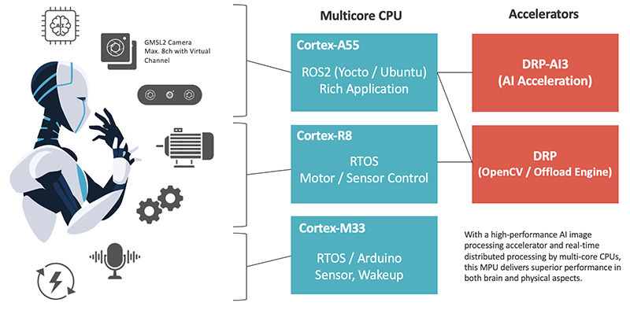
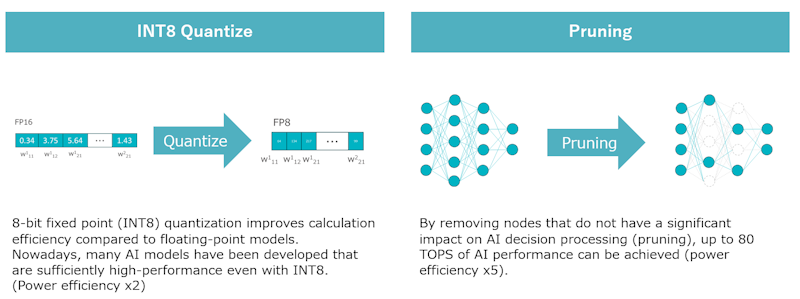
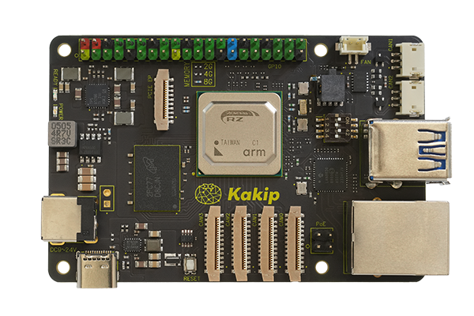
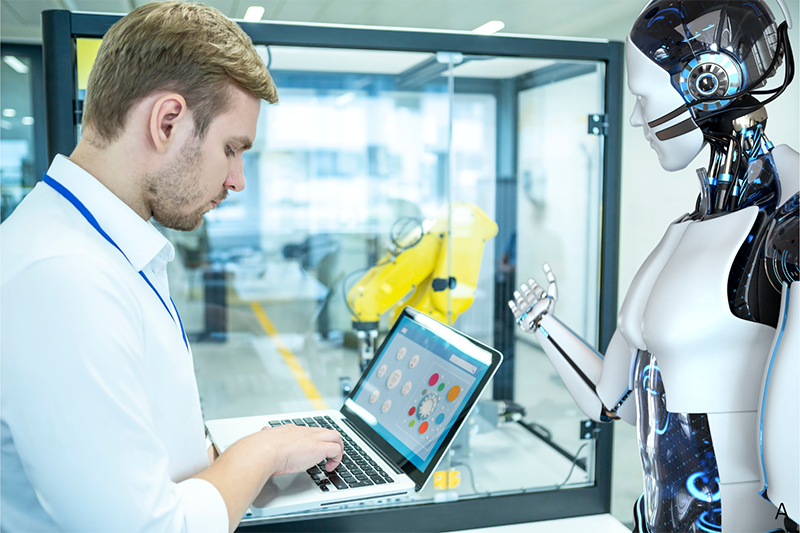

# AI Single Board Computer Kakip

## Kakip Overview

### What is Kakip

"Kakip" is a single board computer equipped with the high-performance AI-MPU Renesas RZ/V2H. This MPU is designed to have a business card-sized, easy-to-handle form factor while taking advantage of its AI inference processing performance and operation by multiple CPU cores. Although it is small, it has many interfaces including 4ch camera input, so it can be used for research and development, POC development and production, and embedding in various applications such as robotics.
***
### Core processor Renesas "RZ/V2H"

The Renesas RZ/V2H installed in Kakip is a heterogeneous AI-MPU with an accelerator that achieves excellent AI inference processing performance and image processing performance, and multiple ARM CPU cores. Not only does it provide efficient AI image processing (brain), but it also has high performance in the physical aspect of operating external devices by parallel processing in each CPU core, so it is a chip that can be used most effectively in autonomous driving robots, which require a high level of integration of brains and physicality.

The CPU is mainly Cortex-A55 and operates Linux, while the Cortex-R8 RTOS controls motors in parallel, and the Cortex-M33 can run WakeUp and Arduino. It is excellent in that multiple CPU cores can be controlled by the OS. In addition, AI inference processing is processed at high speed by the accelerator "DRP-AI3" that can process independently of the CPU, and image processing such as OpenCV is processed in parallel by another vision accelerator "DRP", which can streamline the image processing process in applications such as VSLAM.

The AI ​​accelerator "DRP-AI3" can provide a maximum performance of 80 TOPS. (In the case of the most optimized model after pruning) It has a processing performance of 8 TOPS even under normal circumstances, and has very good performance for a single board computer form factor. By adopting INT8 quantization and pruning, it also has an advantage in power performance TOPS/W. It is a specification that can also contribute to reducing power consumption.
***

### Abundant interfaces concentrated in a business card size

In addition to a camera input that can input up to 4ch, it is equipped with various interfaces such as USB, Ethernet, GPIO, CAN FD, microSD card slot, PCIe EP, etc., so you can work on research and development and POC production without going through a carrier board.
***

### Solutions provided by Kakip

With the excellent features and performance described above, Kakip is ideal for development of various applications including robotics and for incorporating into POC production.

** For developing a wide range of applications **

* Autonomous robots such as AMR (Autonomous Mobile Robot), HSR (Human Support Robot), and humanoids
* Drones
* IoT monitoring equipment and factory vision sensors
* Incorporation into CCTV
* R&D and academic research such as Rapid Protorype
* Hobby applications such as Turtlebot