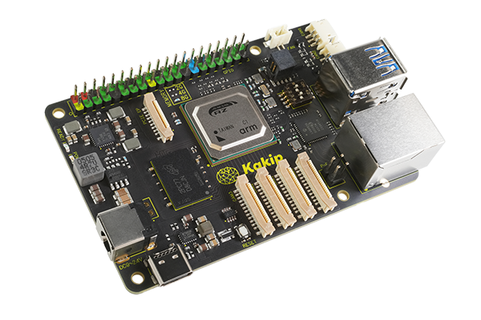
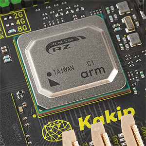
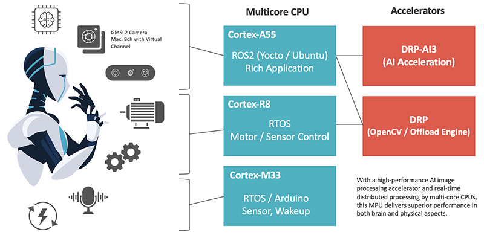
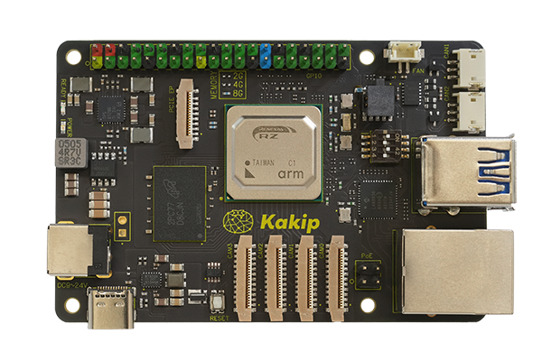

# AI Single Board Computer Kakip（カキピー）

## Kakipの概要

### Kakipとは

「Kakip（カキピー）」は高性能AI-MPU Renesas RZ/V2Hを搭載するSingle Board Computerです。このMPUの持つAI推論処理性能や複数のCPUコアによるオペレーションを活かしつつ、名刺サイズで扱いやすいフォームファクタに設計しています。小型でありながら、4chのカメラ入力をはじめとする多くのインターフェースを備えているため、ロボティックス他、様々なアプリケーションにおいて研究開発やPOC開発・制作、組込にご使用いただける製品です。
***
### コアプロセッサ Renesas "RZ/V2H"

Kakipに搭載されているRenesas RZ/V2Hは優れたAI推論処理性能と画像処理性能を実現するアクセラレータと、複数のARM CPUコアを持つヘテロジニアスなAI-MPUです。効率的なAI画像処理（頭脳）だけではなく、各CPUコアでの並行処理で外部機器を動かすようなフィジカル面でも高性能であるため、特に頭脳とフィジカルの高度な融合が必要な自律走行ロボットなどに最も力を発揮できるチップです。

CPUはCortex-A55をメインにLinuxでオペレーションし、Cortex-R8のRTOSで並行してモーター制御、Cortex-M33でWakeUpやArduinoを動かすことも可能です。複数のCPUコアをそれぞれにOSで制御できる点が優れています。また、AI推論処理はCPUとは独立して処理ができるアクセラレータ「DRP-AI3」で高速処理、OpenCVなどの画像処理を別のVisionアクセラレータ「DRP」で並行処理することで、VSLAMなどのアプリケーションにおける画像処理プロセスを効率化できます。

AIアクセラレータ「DRP-AI3」により最大80TOPSのパフォーマンスを得ることができます。（枝刈りを行なって最も最適化されたモデルの場合）通常でも8TOPSの処理性能を持っており、シングルボードコンピュータのフォームファクタとしては非常に優れたパフォーマンスがあります。INT8量子化の採用、枝刈りにより、電力性能TOPS/Wにおいても優位性があります。消費電力を抑える点でも貢献できる仕様です。
***

### 名刺サイズに集約した豊富なインターフェース

最大4chまで入力可能なカメラ入力をはじめとして、USB、Ethernet、GPIO、CAN FD、microSDカードスロット、PCIe EPなど、様々なインターフェースを搭載しており、キャリアボードを介することなく研究開発やPOC制作に取り組んでいただくことが可能です。
***

### Kakipが提供するソリューション

上記のような優れた特徴と性能を持つKakipは、ロボティックスをはじめとする様々なアプリケーションの開発やPOC制作への組込に最適です。

** 幅広いアプリケーションの開発に **

* AMR (Autonomous Mobile Robot)やHSR (Human Support Robot)、ヒューマノイドなどの自律型ロボット
* ドローン
* IoT監視機器や工場のビジョンセンサ
* CCTVへの組込
* Rapid Protorypeなどの研究開発、学術研究
* タートルボットなどのホビー用途